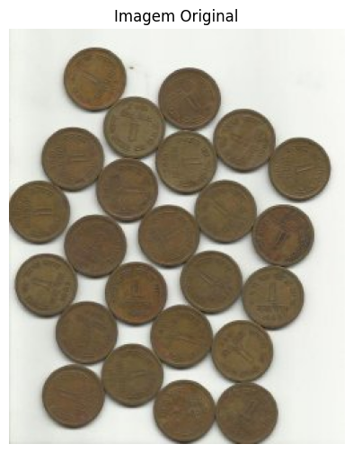
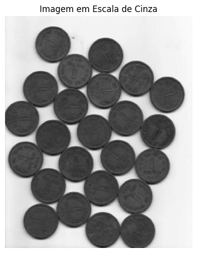
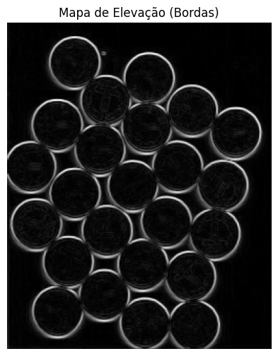
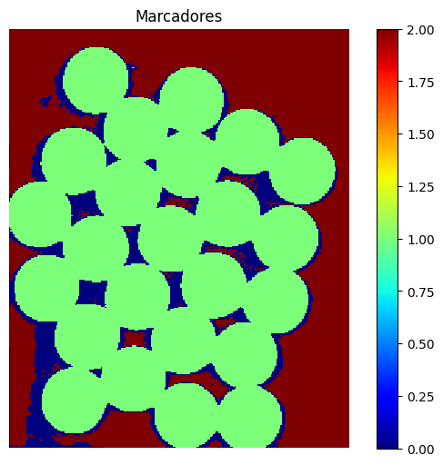
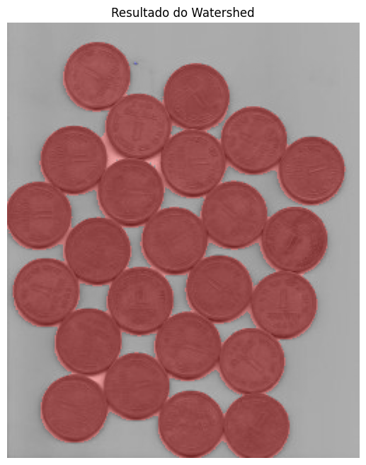

# Watershed Segmentation

- Autor: Diego Giovanni de Alcântara Vieira

- PGENE523 - Digital Image Processing

- PPGEE - Post Graduate Program in Electrical Engineering

- UFAM - Federal University of Amazonas

# Repository Structure

- `matlab` - MATLAB code using Image Processing Toolbox functions
    - `examples`
      - `main.m` - example applying watershed segmentation to a given image.
      - `watershed_high_level_2d.m` - example applying watershed segmentation to a 2-dimensional binary image written on the file.
      - `watershed_high_level_3d.m` - example applying watershed segmentation to a 3-dimensional figure written on the file.
    - `src` - each function needed on the watershed segmentation process.
      - `applyWatershed` - apply watershed segmentation
      - `binarizeImage` - apply binarization using Otsu Method
      - `calculateComplementeDistanceTransform` - computes the complement of the distance transform
      - `calculateDistanceTransform` - computes distance transform
      - `fillHoles` - Preprocessing function that removes noises from the image
      - `main` - main file of the application
      - `overlaySegmentation` - postprocessing function that applies overlaying of the result image to the original image
      - `removeSmallObjects` - preprocessing function that removes noises from the image
- `python` - Python Code using OpenCV, Scikit-Image and Numpy
    - `images` - images used on the application
    - `notebooks`
      - `watershed_opencv` - jupyter notebook applying watershed segmentation using OpenCV framework
      - `watershed_scikit_image` - jupyter notebook applying watershed segmentation using Scikit-Image framework
    - `src` - framework using only python native libraries and numpy to implement the watershed segmentation steps
      - `filters` - package to implement spatial filtering
      - `morph` - package to implement morphologic operations
      - `segmentation` - package to implement segmentation operations
      - `thresh` - package to implement thresholding operations
      - `transforms` - package to implement transform operations
      - `example.py` - execute the Watershed Segmentation using OpenCV package
      - `main.py` - execute the Watershed Segmentation using the proprietary package

# Result Examples

## The image to be processed: 

  
  

## Images with the topographic elevation maps - Dams.

## Image with Markers

## Segmented Resulting Image

